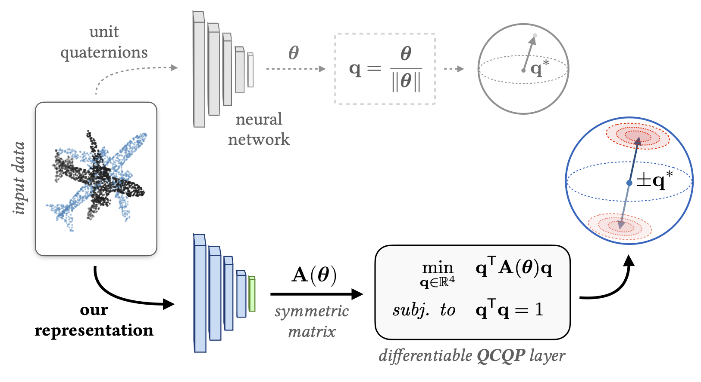

#A Smooth Representation of SO(3) for Deep Rotation Learning with Uncertainty
### To appear at Robotics: Science and Systems (2020)
Paper website: https://valentinp.com/bingham-rotation-learning
arXiv paper:


There are many ways to represent rotations including Euler angles, rotation matrices, axis-angle vectors, and unit quaternions. In deep learning applications, it is common to use unit quaternions for their simple geometric and algebraic structure. However, unit quaternions lack an important smoothness property that makes learning 'large' rotations difficult, and other representations are not easily amenable to learning uncertainty. In this work, we address this gap through a symmetric-matrix-based representation that is both smooth and defines a <em>belief</em> (or distribution) over rotations. 

This repository contains example code to implement our representation in your work and all of our experiments from the paper (in `pytorch`). 

# Get Started

### Prerequistes

Standard stuff:
`numpy, scipy, torch, torchvision, argparse, matplotlib`

Slightly less standard stuff:
`tqdm, tensorboardx`

To run our experiments, you will need to clone / install our own `pytorch`/`numpy` library:
`liegroups`, available [here](https://github.com/utiasSTARS/liegroups) (unfortunately not yet on pip)

### Run the demo!
The demo will train three models on a synthetic point cloud dataset, with the unit quaternion, six dimensional representation (*Zhou et. al, CVPR 2019 -- [41] in the paper*), and our symmetric **A** representation.

`python run_rotation_learning_experiment.py`

You can see alist of options within the script.

### Recreate our experiments

See the *experiments* folder for all of our experimental scripts. 

# Use Our Representation in Your Work

Our representation is very easy to use for any rotation learning!

1. Create a network that outputs 10-vectors (i.e., Bx10 matrices for a minibatch size B).

2. Create a function that converts each 10-vector into a symmetric 4x4 matrix (Bx4x4). We have written a function `convert_Avec_to_A()` which you can steal! The file `qcqp_layers.py` contains this function as well as some other (batch-ified) helper functions that may be useful.

3. To convert each 4x4 symmetric matrix into a unit quaternion, simply apply `torch.symeig()` and extract the eigenvector corresponding to the smallest eigenvector. This function can be a simple as:

    ```python
    def A_vec_to_quat(A_vec):
        A = convert_Avec_to_A(A_vec)
        _, evs = torch.symeig(A, eigenvectors=True)
        return evs[:,:,0].squeeze()
    ```
    Our version of this function (see `qcqp_layers.py`) has a small check for dimensionality but is othewise identical to the one above. Note that we have also implemented a `torch.autograd` function with an explicit analytic gradient but the built-in pytorch differentiation of `torch.symeig()` results in identical performance. Feel free to use either.

This entire procedure can be implemented within your model. For example:
```python
class RotationNet(torch.nn.Module):
    def __init__(self):
        super(RotationNet, self).__init__()
        self.net = GenericNet() #Outputs Bx10
    
    def A_vec_to_quat(self, A_vec):
        A = convert_Avec_to_A(A_vec)
        _, evs = torch.symeig(A, eigenvectors=True)
        return evs[:,:,0].squeeze()

    def forward(self, x):
        A_vec = self.net(x) #Bx10 -> Bx4x4
        q = self.A_vec_to_quat(A_vec)
        return q #unit quaternion!
```
This incurs minimal (but non-zero) overhead and should improve training you have `large' rotation targets (i.e., rotations close to 180 degrees about any axis).

## Citation
If you use this in your work, please cite:
<pre>
@inproceedings{peretroukhin_so3_2020,
   author={Peretroukhin, Valentin and Giamou, Matthew and Rosen, David and Greene, W. Nicholas and Roy, Nicholas and Kelly, Jonathan},
   title={A {S}mooth {R}epresentation of {SO(3)} for {D}eep {R}otation {L}earning with {U}ncertainty},
   booktitle={Proceedings of Robotics: Science and Systems},
   year={2020},
   doi={TBD},
   url={TBD}
}
</pre>
